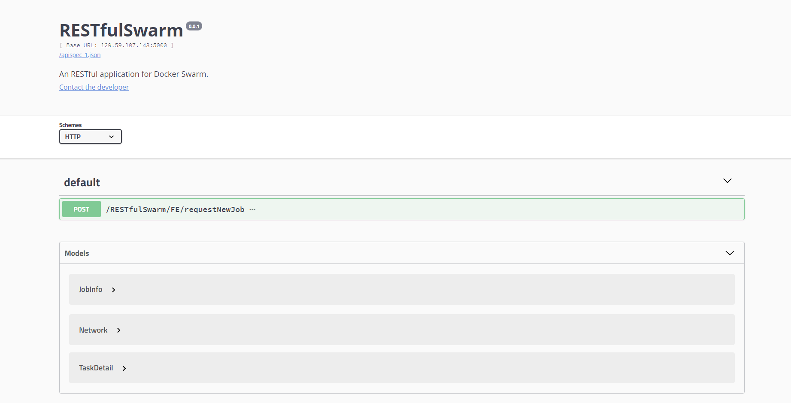
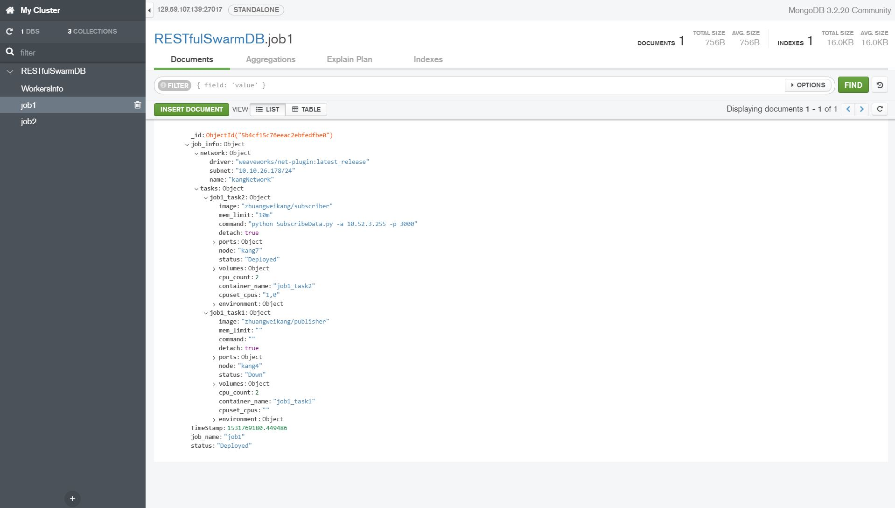

RESTfulSwarm
============
An environment for core simulation based on Docker Swarm

## [Environment (Prerequisites)](https://github.com/doc-vu/RESTfulSwarm/blob/master/dependences.sh)
* Ubuntu 16.04
* Python3
* Docker 17.12 (with experimental feature)
* CRIU
* Flask
* ZeroMQ
* Swagger
* MongoDB
* NFS
```Bash
./dependences.sh
```
## Notion
* Job: A list of containers with same network 
  1. Job name format: 'job'Submit_time-session_id
     >> example: job1533585500968-1533585495
* Task: Container in Docker
  1. Task name format: jobname_task
     >> example: job1533585500968-1533585495_task1
* Session:
  1. ManagementEngine launch the system once
  
## Architecture

### SC--StressClient (Job# vs. Time)
* Role: Generate test data and feed data into the system
* SC types:
  1. Steady Stress Client
     * F(t) = a, a is steady constant
  2. Bursty Stress Client
     * Exponential distribution, with configurable constant lambda
  3. Incremental Stress Client
     * F(t) = at + b, a and b are constant
  4. Random Stress Client
     * F(t) = a, a is random constant

### FE--FrontEnd(RESTful)
* Role: Receive data from Stress Client and initialize Job collection in MongoDB
* Swagger Interface


### JM--JobManager
* Role: 
    1. Send RESTful call to GM
    2. Apply scheduling strategy on requested & free resources to get scheduling and waiting decision
    3. Maintain a job queue to buffer waiting jobs
    5. Update MongoDB when job info changed
* Provided Functions:
    1. Deploy job (POST)
    2. Deploy single task (POST)
    3. Migrate task (POST)
    4. Migrate job (POST)
    5. Update task (POST)
    6. Checkpoint task (POST)
    7. Remove worker in Swarm mode (GET)
    8. Describe Worker nodes (GET)
    9. Describe GM (GET)
* Scheduling Strategies
    1. Bin Packing
       - Best Fit
       - First Fit
       - Best Fit Decreasing
       - First Fit Decreasing
    2. Node Scheduling
       - Client specify worker node and cpuset_cpus information
    3. Priority Scheduling (in-progress)
* Job state chart

  
### GM--GlobalManager (RESTful)
* Role: 
  1. Notify worker nodes to conduct commands passed from JM
  2. Initialize Swarm environment and play the role of master node
  3. Update MongoDB
  4. Periodically prune unused resources in swarm cluster
  5. NFS master
* Swagger Interface


### Woker
* Role:
  1. Worker node in Swarm mode
  2. Deploy tasks
  3. Periodically collect finished tasks info and notify Discovery to update task status
  4. NFS client

### DIS--Discovery
* Role:
  1. Received notification from Workers to update Job and tasks status

### ME--ManagementEngine
* Role:
  1. Launch SC, FE, JM, GM, DIS, ME as separate processes in one VM/PM
  2. Launch all remote workers using SSH
  3. Terminate processes running in either local machine or remote worker machines

### MongoDB Interface




Note: StressClient, Discovery, FrontEnd and JobManager have been dockerrized. 